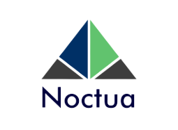

# Noctua - Grupo (DashBoard Brasil IO)

  

<h1 align="center">Development</h1>

## Objetivo 

&emsp;&emsp;O objetivo mor do projeto é facilitar a relação dados/usuário. A mediação será feita por intermédio de um produto que coadjuve no melhor entendimento de uma grande quantidade de dados. 

## Contribuidores

|Nome                             |GitHub                             | 
| --------                        | --------                          |
|Matheus Soares Arruda            | https://github.com/MtsSrs         |
|Mateus Caltabiano Neves Frauzino |https://github.com/MateusCaltabiano|
|Matheus Moreira Lopes Perillo    |https://github.com/MatheusPerillo  |
|Joao Victor Correia de Oliveira  |https://github.com/CorreiaJV       |
|Pedro Henrique Nogueira Gonçalves|https://github.com/phnog           |
|Iago de Paula Cabral             |https://github.com/iagocabral      |
|Murilo Perazzo Barbosa Souto     |https://github.com/murilopbs       |
|Ian da Costa Gama                |https://github.com/ian-dcg         |
|Matheus Henrick Dutra dos Santos |https://github.com/MatheusHenrickSantos|
|Charles Manrique Serafim Morais  |https://github.com/charles-serafim |
|Júlio César Martins França       |https://github.com/Julio-eng       |
|Igor Thiago Lima de Santana      |https://github.com/Alladin-51      |
|Fellipe Pereira da Costa Silva   |https://github.com/fellipepcs      |
|Matheus Moreira da Silva Vieira  |https://github.com/matheusmsvieira |
|Eurico Menezes de Abreu Neto     |https://github.com/EuricoAbreu     |

## Releases
