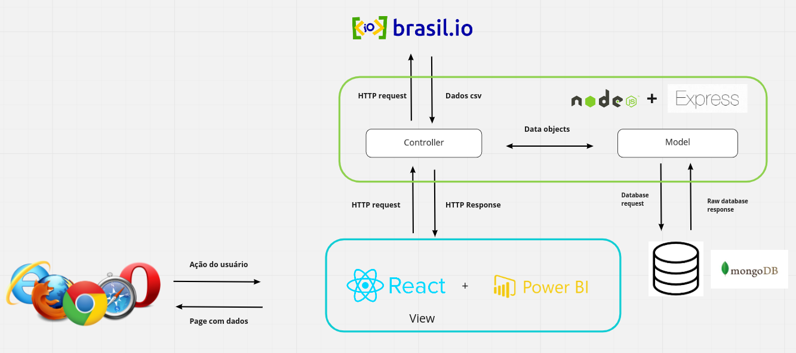

# Documento de Arquitetura de Software

## Histórico de Revisão

| Data       | Versão | Descrição             | Autor               |
| ---------- | ------ | --------------------- | ------------------- |
| 29/01/2022 | 1.0    | Abertura do Documento | João Victor Correia |
| 31/01/2022 | 1.0.1  | Adição visão lógica   | João Victor Correia |

## 1. Introdução

### 1.1 Finalidade

 &emsp;&emsp; O Seguinte documento tem como finalidade mostrar e esclarecer de uma forma geral a arquitetura utilizada no projeto, tornando o seu processo de entendimento o mais simples possível. Além disso, esse documento também tem como objetivo demonstrar as decisões arquiteturais tomadas pelo grupo em relação ao projeto.

### 1.2 Escopo

 &emsp;&emsp; Esse documento visa permitir ao leitor se informar sobre a arquitetura utilizada no projeto, incentivando um entendimento mais simples e eficaz acerca do produto.

### 1.3 Definições, Acrônimos e Abreviações

| Abreviação | Significado                            |
| ---------- | -------------------------------------- |
| **MDS**    | Métodos de Desenvolvimento de Software |
| **UnB**    | Universidade de Brasília               |
| **MVC**    | Model-View-Controller                  |
| **API**    | Applications Protocol Interface        |
| **JSON**   | JavaScript Object Notation             |

### 1.4 Visão Geral

---

**Introdução:** Fornece uma visão geral e introdutória sobre o documento;

---

**Representação Arquitetural:** Fornece informações sobre as tecnologias e os motivos pelos quais elas foram escolhidas;

---

**Metas e Restrições:** Demonstra as metas e restrições aplicadas no projeto;

---

**Visão Lógica:** Apresenta como os frameworks interagem entre si e com o usuário;

---

## 2. Representação Arquitetural

### 2.1 Back-end

#### 2.1.1 Node.Js

 &emsp;&emsp; Node.Js é um software de código aberto, multiplataforma, baseado no interpretador V8 do Google e que permite a execução de códigos JavaScript fora de um navegador web.

 &emsp;&emsp;
    Com  ele é possível criar aplicações Javascript para rodar como uma aplicação standalone(que não necessita de softwares auxiliares) em uma máquina, não dependendo de um browser para a execução, como é o usual.

  &emsp;&emsp; O principal motivo de sua adoção é a sua alta capacidade de escala. Além disso, sua arquitetura, flexibilidade e baixo custo, o tornam uma boa escolha para implementação de MVC e componentes da arquitetura Serverless.
    

#### 2.1.2 Express

 &emsp;&emsp; O Express.js é um framework Node que facilita o desenvolvimento criando abstrações de rotas, middlewares e muitas outras funções para facilitar a implementação de API's. Dentre suas principais características, podemos citar: Sistema de rotas completos, tratamento de exceções dentro da aplicação e gereciamento de requisições HTTP com seus mais diversos verbos.

 &emsp;&emsp; Outro ponto de interesse no framework se diz respeito da utilização do padrão Model-View-Controller, modelo esse que facilita a troca de informações entre a interface do usuário aos dados no banco, fazendo com que as respostas sejam mais rápidas e dinâmicas..

- **Model**: Camada responsável por representar o negócio e pelo acesso e manipulação dos dados.
- **View**: Camada responsável por processar requests de usuários e retornar responses.
- **Controller**: Camada responsável por ligar o model e a view, fazendo com que os models possam ser repassados para as views e vice-versa.

### 2.2 Front-End

#### 2.2.1 Flutter

 &emsp;&emsp;O Flutter é um framework desenvolvido pela Google na linguagem Dart e permite que sejam criadas aplicações nativas para os aparelhos iOS e Android. Por ter essa facilidade de desenvolvimento para dois sistemas diferentes, o framework tem crescido bastante e tornado cada vez maior a quantidade de informação para aprendizado.

 &emsp;&emsp; Além disso, por ser um framework que possui uma curva de aprendizado muito boa e alguns dos integrantes do grupo já terem conhecimento prévio relacionado à linguagem, ela foi selecionada para atuar no front-end.

 &emsp;&emsp; Outro ponto importante na escolha desse framework se deve ao fato do Dart ser otimizado bem como ser especializado para criação de interfaces para usuários através do uso dos widgets (estrutura baseada no React). Assim também, o uso de <b>Blocs</b> permite que o software seja dividido em questão de interface de usuário e regras de negócio, e o uso de <b> 
Stream</b> permite eventos assíncronos no aplicativo.

### 2.3 Banco de Dados

#### 2.3.1 MongoDB

 &emsp;&emsp;O MongoDB é um banco de dados opensource, de alta performance e flexível, sendo considerado o principal banco de dados NoSQL. É orientado a documentos, ou seja, os dados são armazenados como documentos, ao contrário de bancos de dados de modelo relacional, onde é trabalhado com registros em linhas e colunas. Os documentos podem ser descritos como dados no formato de chave-valor, no caso, utilizando o formato JSON (JavaScript Object Notation).

    A escolha de um banco de dados não relacional se deve a grande quantidades de dados que o software terá que lidar e a flexibilidade necessária para isso. Esse tipo de banco não exige a rigidez dos esquemas e torna possível adicionar novas propriedades, sem a preocupação com o impacto nas demais informações já armazenadas.

## 3. Metas e Restrições

### 3.1 Metas

 &emsp;&emsp; O projeto visa facilitar a visualização e análise dos dados disponíveis no Brasil.io através de uma aplicação online e de fácil utilização

### 3.2 Restrições

#### 3.2.1 Compatibilidade

- O aplicativo será compatível com os aparelhos celulares que possuem o sistema operacional Android e tem acesso à Play Store, bem como é necessário o acesso à internet.

#### 3.2.2 Usabilidade

- O sistema visa ser intuitivo e de simples uso, evitando assim que a utilização não seja um empecilho.

#### 3.2.3 Confiabilidade

- A aplicação buscará obter ao menos 90% de cobertura em testes, garantindo assim a funcionalidade do sistema.

## 4. Visão Lógica

 &emsp;&emsp; As ações do usuário no ambiente mobile serão interpretadas pelo Flutter como gestos, onde cada gesto está associado com um evento que irá disparar uma ação. Algumas dessas ações poderão ser tratadas no lado do cliente (client side), como ações de iteratividade que não precisam de comunicação externa.

 &emsp;&emsp;Já em outras ações será preciso consultar um banco de dados no lado do servidor (server side), assim sendo preciso enviar uma solicitação (HttpRequest) para o servidor, utilizado o protocolo de comunicação HTTP.

 &emsp;&emsp;Uma vez que o servidor receba a solicitação do cliente, será preciso interpretar o request com base na URL e no método HTTP utilizado. Essa computação é realizada pela camada controller que verificará a necessidade de se comunicar com a API Brasil.io para obtenção de dados. 

 &emsp;&emsp; Caso seja necessário, o controller disparará uma requisição HTTP para obter as informações desejadas. Com a resposta da API Brasil.io o controller enviará os dados para a camada model que salvará no banco o JSON e logo em seguida o retornará para que o controller disponibilize para a camada view que exibirá para o cliente.  

 &emsp;&emsp; Caso não precise de comunicação com a API o controller requisitará a camada model os dados já salvos previamente e está o retornará para que seja exibido para o cliente na camada view. 

### Referências

> Como documentar a arquitetura de software. Disponível em: < [http://www.linhadecodigo.com.br/artigo/3343/como-documentar-a-arquitetura-de-software.aspx](http://www.linhadecodigo.com.br/artigo/3343/como-documentar-a-arquitetura-de-software.aspx) > Acesso em: 13 de Fevereiro de 2021

> Documento de arquitetura Acácia. Disponível em: < [https://fga-eps-mds.github.io/2019.2-Acacia/#/architecture_document](https://fga-eps-mds.github.io/2019.2-Acacia/#/architecture_document) > Acesso em: 13 de Fevereiro de 2021

> Documento de arquitetura Hortum. Disponível em: < [https://fga-eps-mds.github.io/2020.2-Hortum/Documento_de_arquitetura/](https://fga-eps-mds.github.io/2020.2-Hortum/Documento_de_arquitetura/) > Acesso em: 13 de Fevereiro de 2021

> Flutter Documentation. Disponível em: < [https://flutter.dev/docs](https://flutter.dev/docs) > Acesso em: 24 de Fevereiro de 2021

> TEMPLATE Documento de Arquitetura de Software. Disponível em: < [https://github.com/DroidFoundry/DroidMetronome/wiki/TEMPLATE-Documento-de-Arquitetura-de-Software](https://github.com/DroidFoundry/DroidMetronome/wiki/TEMPLATE-Documento-de-Arquitetura-de-Software) > Acesso em: 13 de Fevereiro de 2021
